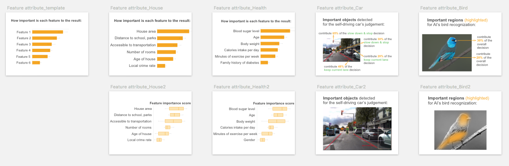
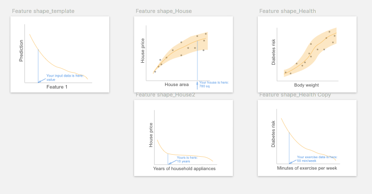
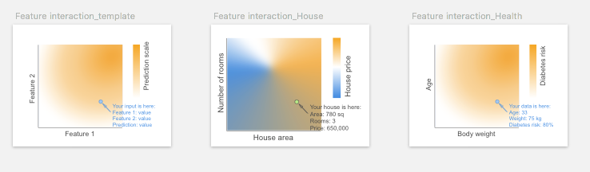
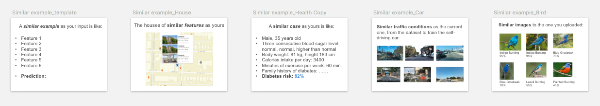
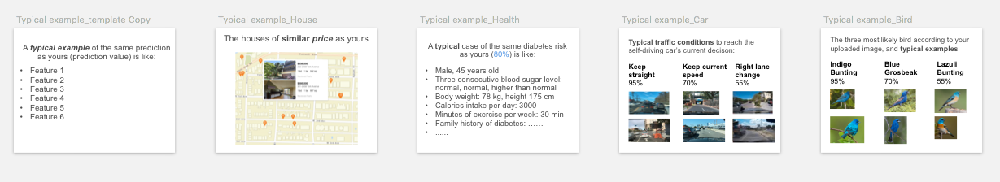
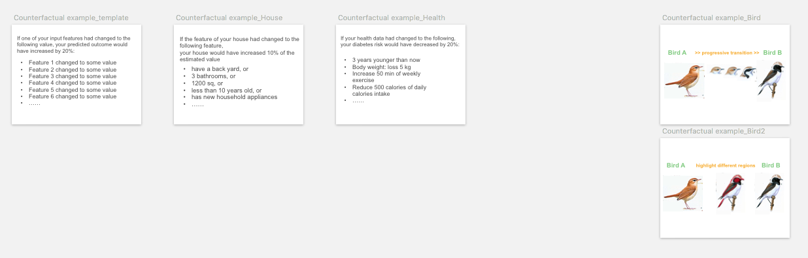
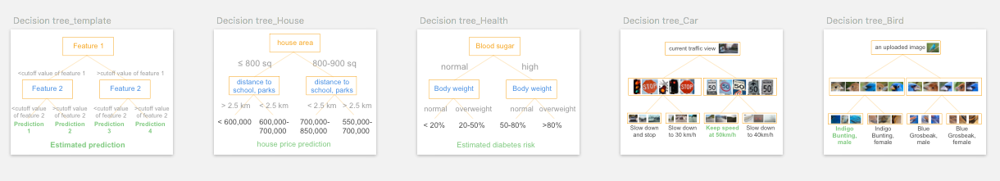
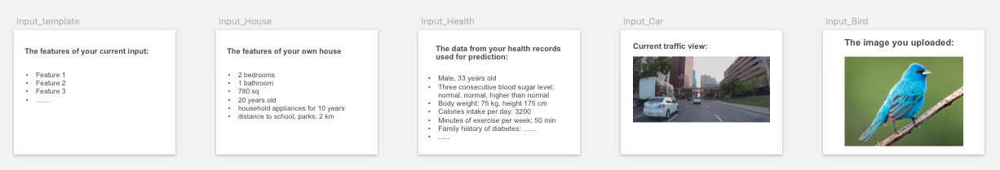
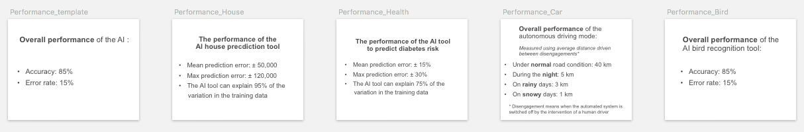
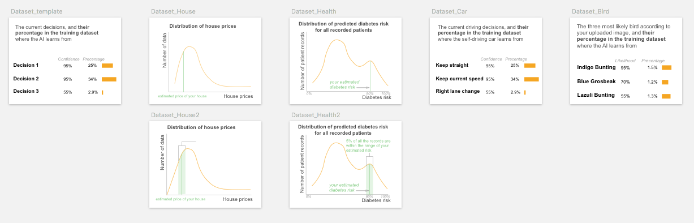

# End-User-Friendly Explanation Forms

We identify end-user-friendly explanation forms from technical literature. By end-user-friendly we mean the users are not required to have technical knowledge to understand the explanation.

**Index**

* [Feature-based explanation](#feature)  
1. [Feature Attribute](#fa)  
2. [Feature Shape](#fs)  
3. [Feature Interaction](#fi)  

 * [Example-based explanation](#example)  
4. [Similar Example](#se)  
5. [Typical Example](#te)  
6. [Counterfactual Example](#ce)  

* [Rule-based explanation](#rule)  
7. [Rule](#rl)  
8. [Decision Tree](#dt)  

* [Contextual information](#suppl)  
9. [Input](#input)  
10. [Output](#output)  
11. [Performance](#perf)  
12. [Dataset](#data)  

 **Comparison table: You may jump to corresponding sections by clicking on the blue text**

| **Explanation form**             | **User-Friendly Level (3:most friendly)**  | **Local/global** | **Datatype**     |**Visual representations** |**Pros**                                                                                                  | **Cons**                                                                                 |**UI/UX Design Implications**  |  **Applicable explanation goals**                                                     | **XAI algorithms**                                                                                                                                                                                                                                                                                                                                                                                                                                                                                                        |
|-----------------------------------|----|--------------|-----------------|-----------------------------------------------------------------------------------------------------------|------------------------------------------------------------------------------------------|------------------------------------------------------------------------------------------|---------------------------------------------------------------------------------------------------------------------------------------------------------------------------------------------------------------------------------------------------------------------------------------------------------------------------------------------------------------------------------------------------------------------------------------------------------------------------------------------------------------------------|
| **[Feature Attribute](#fa)**      |&#9733; &#9733; &#9733; | Local/Global     | Tabular/Img/Txt | [Saliency map; Bar chart](explanation_form.md#fa_v)|[Simple and easy to understand; Can answer *how* and *why* AI reaches its decisions.](explanation_form.md#fa_p)                      | [Illusion of causality, confirmation bias](explanation_form.md#fa_c)     | [Alarm users about causality illusion; Allow setting threshold on importance score, show details on-demand](explanation_form.md#fa_d)                                              | [To verify AI's decision](explanation_form.md#fa_n)                                                                   | [LIME ](https://arxiv.org/abs/1606.05386), [SHAP](https://arxiv.org/abs/1705.07874), [CAM](https://arxiv.org/abs/1512.04150), [LRP](https://journals.plos.org/plosone/article?id=10.1371/journal.pone.0130140), [TCAV](https://arxiv.org/abs/1711.11279)                                                                                                                                                                                                                                                                  |
| **[Feature Shape](#fs)**          |&#9733; &#9733; | Global           | Tabular       | [Line plot](explanation_form.md#fs_v)  | [Graphical representation, easy to understand the relationship between one feature and prediction](explanation_form.md#fs_p)          | [Lacks feature interaction; Information overload if multiple feature shapes are presented](explanation_form.md#fs_c) | [Users can inspect the plot of their interested features; May indicate the position of local data points (usually users’ input data)](explanation_form.md#fs_d)| [To control and improve the outcome; To reveal bias](explanation_form.md#fs_n)                                       | [PDP](https://statweb.stanford.edu/~jhf/ftp/trebst.pdf), [ALE](https://arxiv.org/abs/1612.08468), [GAM](https://arxiv.org/abs/1801.08640)                                                                                                                                                                                                                                                                                                                                                                                 |
| **[Feature Interaction](#fi)**    |&#9733; | Global           | Tabular        | [2D or 3D heatmap](explanation_form.md#fi_v) | [Show feature-feature interaction](explanation_form.md#fi_p)                                                                          | [The diagram on multiple features is difficult to interpret](explanation_form.md#fi_c)                         | [Users may select their interested feature pairs and check feature interactions; or XAI system can prioritize significant feature interactions](explanation_form.md#fi_d)         | [To control and improve the outcome](explanation_form.md#fi_n)                                                         | [PDP](https://statweb.stanford.edu/~jhf/ftp/trebst.pdf), [ALE](https://arxiv.org/abs/1612.08468), [GA2M](http://yinlou.github.io/papers/caruana-kdd15.pdf)                                                                                                                                                                                                                                                                                                                                                                |
| **[Similar Example](#se)**        |&#9733; &#9733; &#9733; | Local            | Tabular/Img/Txt| [Data instances as examples](explanation_form.md#se) | [Easy to comprehend, users intuitively verify AI’s decision using analogical reasoning on similar examples](explanation_form.md#se_p) | [It does not highlight features within examples to enable users’ side-by-side comparison](explanation_form.md#se_c) | [Support side-by-side feature-based comparison among examples](explanation_form.md#se_d) | [To verify the decision](explanation_form.md#se_n)                                                                   | [Nearest neighbour](https://en.wikipedia.org/wiki/Nearest_neighbour_algorithm), [CBR ](https://web.media.mit.edu/~jorkin/generals/papers/Kolodner_case_based_reasoning.pdf)                                                                                                                                                                                                                                                                                                                                               |
| **[Typical Example](#te)**        |&#9733; &#9733; | Local/Global     | Tabular/Img/Txt | [Data instances as examples](explanation_form.md#te_v)| [Use prototypical instances to show learned representation; Reveal potential problems of the model](explanation_form.md#te_p)         | [Users may not appreciate the idea of typical cases](explanation_form.md#te_c)                           | [May show within-class variations, or edge cases](explanation_form.md#te_d)             | [To verify the decision; To reveal bias ](explanation_form.md#te_n)                                                  | [k-Mediods](https://en.wikipedia.org/wiki/K-medoids), [MMD-critic ](https://papers.nips.cc/paper/6300-examples-are-not-enough-learn-to-criticize-criticism-for-interpretability),  Generate prototype([Simonyan](https://arxiv.org/abs/1312.6034v2), [Mahendran2014](https://arxiv.org/abs/1412.0035)), CNN prototype([Li2017](https://arxiv.org/abs/1710.04806), [Chen2019](https://papers.nips.cc/paper/2019/hash/adf7ee2dcf142b0e11888e72b43fcb75-Abstract.html)), [Influential instance](https://arxiv.org/abs/1703.04730)                                                    |
| **[Counterfactual Example](#ce)** |&#9733; &#9733; | Local            | Tabular/Img/Txt | [Two counterfactual data instances with their highlighted contrastive features, or a progressive transition between the two](explanation_form.md#ce_v)| [Helpful to identify the differences between the current outcome and another contrastive outcome](explanation_form.md#ce_p)           | [Hard to understand, may cause confusion](explanation_form.md#ce_c)                                               | [User can define the predicted outcome to be contrasted with, receive personalized counterfactual constraints; May only show controllable features](explanation_form.md#ce_d)   | [To differentiate between similar instances; To control and improve the outcome](explanation_form.md#ce_n)           | [Inverse classification](http://www.doi.org/10.1007/978-3-319-91473-2_9), [MMD-critic](https://papers.nips.cc/paper/6300-examples-are-not-enough-learn-to-criticize-criticism-for-interpretability), [Progression](http://www.cs.sfu.ca/~hamarneh/ecopy/miccai_grail2017.pdf), [Counterfactual Visual Explanations](https://arxiv.org/abs/1904.07451v2), [Pertinent Negative](https://papers.nips.cc/paper/2018/file/c5ff2543b53f4cc0ad3819a36752467b-Paper.pdf) |
| **[Decision Rules/Sets](#rl)**    |&#9733; &#9733; | Global           | Tabular/Img/Txt | [Present rules as text, table, or matrix](explanation_form.md#rl_v)| [Present decision logic, *"like human explanation"*   ](explanation_form.md#rl_p)                                                     | [Need to carefully balance between completeness and simplicity of explanation](explanation_form.md#rl_c)        | [Trim rules and show on-demand; Highlight local clauses related to user's interested instances](explanation_form.md#rl_d)     | [Facilitate users' learning, report generation, and communication with other stakeholders](explanation_form.md#rl_n) | [Bayesian Rule Lists](https://arxiv.org/abs/1602.08610), [LORE](https://arxiv.org/abs/1805.10820), [Anchors](https://www.aaai.org/ocs/index.php/AAAI/AAAI18/paper/view/16982)                                                                                                                                                                                                                                                                                                                                             |
|**[Decision tree](#dt)** |&#9733; | Global | Tabular/Img/Txt | [Tree diagram](explanation_form.md#dt_v)|  [Show decision process, explain the differences](explanation_form.md#dt_p) |  [Too much information, complicated to understand](explanation_form.md#dt_c)  | [Trim the tree and show on-demand; Support highlighting branches for user's interested instances](explanation_form.md#dt_d) |  [Comparison; Counterfactual reasoning](explanation_form.md#dt_n)  | [Model distillation ](https://arxiv.org/pdf/1711.09784.pdf), [Disentangle CNN](https://arxiv.org/abs/1802.00121)

---
**About the user study**

The following findings on the identified pros, cons, desing implications and applicable needs were based on our user study interview and card sorting with 32 layperson participants. The interview was conducted based on 4 AI-assisted decision-making **tasks** trying to reflect the diversity of AI-supported critical decision-making. 

The four tasks are: 
* **House** task: users use AI to get
a proper estimate of their house price. 
* **Health** task: users use AI to
predict diabetes risk. 
* **Car** task: users decide whether to buy an
autonomous driving vehicle. 
* **Bird** task: users use AI bird recognition
tool to prepare for an important biology exam. 

For the user study details, please refer to our [research paper](paper/EndUserXAI-manuscript_2021.pdf).

---

# 1. Feature-based explanation

Feature-based explanations are the most common form of explanation information. 

We refer _feature_ to a piece of information that is carried out by the input data. For example, a real estate agent can describe a house by its size, location, and age, three descriptive features; The feature of an image can be the individual pixels, a car object highlighted, or an explicit concept of "car". 

To use features for explanations, the feature representation must be human-interpretable. 

The feature-based explanations consist of three explanation forms:

##  1.1 Feature Attribute

It indicates which features are important for the decision, and what are their attributions to the prediction. For example, it can be a list of key features and their importance scores to the house price prediction, or a color map overlaid on input image indicating the important parts/objects for the recognition. It assumes the prediction is explainable by linearly addable important features.

###  Visual representation

Its visual representation largely depend on the data type of the features. For image and text data, overlaying a **saliency map** or color map on the input is the common visualization. It uses sequential colors to code the fine-grained feature importance score for individual feature (could be pixels for an image input, words for text data). For image/video input data, other popular visualizations include using _masks_, _segmentation maps_ or _bounding boxes_ on the saliency objects.

To visualize multiple feature attributes for tabular or text data, a **bar chart** is typical choice. The variations of bar plot include waterfall plot, treemap, wrapped bars, packed bars, piled bars, Zvinca plots, and tornado plot. _Box plot_ can be used to visualize the distribution of the feature importance score. Its variations include violin plot and beeswarm plot that show more detailed data distribution and skewness.

### Algorithms for implementation

[LIME ](https://arxiv.org/abs/1606.05386), [SHAP](https://arxiv.org/abs/1705.07874), [CAM](https://arxiv.org/abs/1512.04150), [LRP](https://journals.plos.org/plosone/article?id=10.1371/journal.pone.0130140), [TCAV](https://arxiv.org/abs/1711.11279)

###  Pros

Users can **intuitively understood** feature attribute, and would likely accept it as an explanation.

>*" It uses a simple way to highlight the most important parts, and you can see very clearly at your first sight how this can be recognized."* 

> *"It's easy to read. ...And you have a bar (chart) here it's really clear information that people understand instantly."*

By showing *"finer details"* and *"breakdown and weights of features"* *"that AI took into account"* , participants perceived feature attribute **can answer *"how"* and *"why"* questions**.

> *"tells me why", "gives me the behind the scenes", "tells me how AI read things and how it makes decisions", "have an understanding of how much weight AI is giving to each of the factors", "identify key aspect, ...support its reasoning"*.

###  Applicable Explanation Goals

By checking feature importance ranking, participants would instantly *"compare with my own judgment, to see if that aligns with my feature attribute"*, especially when participants need to **verify AI's decision**.

###  Cons

Although a causal relationship may not be confirmed, some participants tended to **assume feature attributeis causal**, or simplify the relationship among features by assuming they are **independent from each other**. This was usually occurred when they were seeking explanation to improve the predicted outcome. And participants were likely to be informed by the feature importance score to prioritize the most important features to take actions upon.

> *"Seeing that body weight is more important than exercise, I think I will focus on changing what I ate, instead of like responding by going to the gym everyday."*  -- Relies on feature attributeto improve the outcome.

> *"It (feature attribute) shows what are the most important factors that AI has taken into account, so you could target the biggest factors."*-- Assumes a causal relationship and prioritizes the action.

> *"If my blood sugar puts me at a super high risk here, but my caloric intake doesn't actually put me at that higher risk, it's like a lower risk, then I would rather just focus on blood sugar. "* -- Ignores the complex interaction between blood sugar and caloric intake.

###  Design Implications

To avoid the above causal illusion, UI/UX design may need to **alarm users** either implicitly or explicitly that changing the important features may not necessarily lead to the outcome change in the real world, due to correlation does not necessarily imply causality.

For designing UI/UX of its prototyping card, designers may consider **varying different representations** of the feature importance, such as showing the feature ranking only and allowing users to check the detailed attribute scores on demand, or allowing users to set a threshold on the attribute score and only showing features above the cut-off value, as suggested by a few participants.

> *"If the percentage (of the feature) is below the cutoff value, the users does not need to see (the feature), reduce the cognitive load."* 

##  1.2 Feature Shape

It shows the relationship between one particular feature and the outcome, such as the house size to the predicted house price. Usually, it is presented as a line plot (for continuous feature) or a bar plot (for categorical feature), depicting whether the relationship between the outcome and a feature is monotonic, linear, or more complex.

###  Visual representation

**Line plot** and _scatter plot_ are common visualizations to show the effect of an individual feature to the predicted outcome.

### Algorithms for implementation

[PDP](https://statweb.stanford.edu/~jhf/ftp/trebst.pdf), [ALE](https://arxiv.org/abs/1612.08468), [GAM](https://arxiv.org/abs/1801.08640)

### Pros

Participants **liked its graphical representation** of showing the relationship between one feature and prediction.

>*"It (feature shape on exercise and diabetes risk) feels so easy to latch onto like it's something that you can impact and something that's very tangible."* 

###  Applicable Explanation Goals

The slope of the curve in feature shape line chart allows users to easily check how changing one feature would lead to the change of the outcome, thus many participants intuitively used feature shape for **counterfactual reasoning**, especially to improve the predicted outcome.

>*"I would be interested to see how much like here (feature shape) increasing the exercise by a small amount actually makes a really big difference. So that's also helpful to decide what you should be focusing on to try to avoid it (diabetes). The shape of the curve actually helps. Coz if I was out here pointing to the flat part of the curve, then it would not be as helpful for me to increase my exercise."*

By showing the relationship between the protected feature and outcomes, it also helps to reveal bias, i.e.: to check if the different values of the protected features (such as male, female) will lead to differences in prediction (such as loan approval).

>*"If these features are related to diabetes, then it (AI) should present some (feature shape) cards to tell me if the gender, age and ethnicity (will affect diabetes prediction), so this image (feature shape) would be really helpful."*

###  Cons

One drawback of feature shape pointed out by a few participants is that it does **not considerate feature interactions**.

>*"This one (feature shape on house size and price) is not based on the bigger the house, the higher you can sell, because it is based on a lot of features. Let's say the house is 2000 square feet. It was built in 1980. Another one is 1000 square feet, but it's just built a decade ago. So its (the latter) price will be much higher than this one (the former). You cannot just base on a house area and then determine the price."* 

Another drawback is that since one feature shape graph can only present one feature, to show multiple features' feature shape the interface will need multiple graphs that may --

> *"make your page so **overloaded**, so people just get tired. You want to make it as clear as possible. So if (there is) some unnecessary information people just intimidated."* 

###  Design Implications

One suggestion for the above weaknesses is that feature shape can be accompanied by other explanation forms and **show on-demand**. Users can select their interested features from a feature list or other explanation forms such as feature attribute, counterfactual example or rule, and choose to view feature shape diagrams of the selected features, as participants suggested:

> *"If I can click on this (feature attribute) and then I can get this chart (feature shape), I think that would be good. I don't think everyone is going to click it, but I think (if) people want more information, you will click it."* 

Many participants tended to check the **local position of their input data point** on the global feature shape diagram.

> *"It's good to see where exactly on a (house price) scale you are."* 

And one participant suggested feature shape could have the assumption that for all the other features that are kept constant, they should be as similar to user's input features as possible.

>*"The AI should assume all the other features are almost the same as mine, considering this hypothesis then this is the (feature shape) curve"*.

## 1.3 Feature Interaction

When features interact with each other, their total effect on the outcome may not be a linear sum of each individual effect. Ficonsiders such interaction and shows the total effect of two or three features to the outcome. It can be regarded as an extension of fsby taking two or more features into account.

###  Visual representation

**2D or 3D heatmap** is used to visualize the effect of feature interactions on the predictions. Limited by the visualization, the heatmap can only show interaction for at most three features (using 3D heatmap). More complicated multiple paired feature-feature interactions can be visualized using matrix heatmap, node-link network, or contingency wheel.

### Algorithms for implementation

[PDP](https://statweb.stanford.edu/~jhf/ftp/trebst.pdf), [ALE](https://arxiv.org/abs/1612.08468), [GA2M](http://yinlou.github.io/papers/caruana-kdd15.pdf)    

###  Applicable Explanation Goals

Since feature interaction just adds one more feature to the (feature-outcome) diagram to show feature-feature interactions, it can be regarded as an expanded version of feature shape, and many of the above findings on feature shape apply to feature interaction as well. Similar to feature shape, feature interaction also supports **counterfactual reasoning** by including two or more features instead of one in feature shape.

> *"(feature interaction on age-body weight interaction) If you put yourself in a hypothetical guessing, you're in this age and this is your body weight, and you can already tell the chances (of diabetes) are high."* 

###  Cons

*"The graph is **less accessible to understand**"*. In our study, only a few participants could correctly interpret the 2D heatmap of two feature interactions.

###  Design Implications

Similar to feature shape, participants would like to **choose their interested feature pairs** to check their interactions on feature interaction diagram. Since the combination of features is large, the XAI system may be able to **suggest interesting feature interactions and prioritize** the feature pairs which have significant interactions.

> *"If I click on any two of them (features), show the relationship between them. If I can choose age and blood sugar level, then probably there is some correlation between them. If it is statistically significant, then I would want to know that. If there is no significance between, for instance, age and body weight, then I don't think it should tell me that. If the AI can tell me that this combination really is important for you to look into, then the priority would also make a lot of sense."* 

---

#  2. Example-based explanation

Human uses examples to learn and explain. Examples carry contextual information and are intuitive for end-users to interpret. Three different types of examples are included:

## 2.1 Similar example

Similar examples are instances that are similar to the input data regarding their features in the feature space.

### Algorithms for implementation
[Nearest neighbour](https://en.wikipedia.org/wiki/Nearest_neighbour_algorithm), [CBR ](https://web.media.mit.edu/~jorkin/generals/papers/Kolodner_case_based_reasoning.pdf)  

### Pros

Participants **intuitively understood** the concept of similar example. Similar example uses analogical reasoning to facilitate to the sense-making process.

> *"It just intuitively makes sense to me. ...similar and typical example are much easier. I don't have to think about them before figuring it out."* 

> *"(similar and typical example) It's similar to how humans make decisions, like we compare similar images to the original (input) one."* 

###  **Applicable Explanation Goals**

Unlike other explanation forms that reveal AI's decision-making process (such as rule-based explanations) , *"even though these (similar and typical example) aren't much specific about how it's actually doing the (decision) process"* , participants' minds automatically made up such a process by themselves by **comparing instances**. Such comparison mainly allow users to **verify AI's decisions** and to calibrate their trust. The common explanation goals in which similar example were selected are:

**1**) To build trust, especially from a personal and emotional level.

> _This (similar example) made me trust on an emotional level. Because I'm thinking, 'Oh really? I am only 33 years old.' Like I probably not going to get diabetes. But then I'm reading about somebody that does (get diabetes), that sounds a lot like me, it kind of emotionally makes me feel like, 'Oh geez, maybe it is accurate.' So this (performance, output) is like using my brain, and this one (similar example) kind of got me in the gut like, 'Oh, okay. This could actually happen to me. It happened to this person who sounds a lot like me.' "_ 

**2**) To verify the decision quality of AI.

> *"It's like a proof for my final decision."* 

> *"Because AI has only 85% accuracy, I want to see similar ones, and what AI thinks they are. "* 

> *"If it doesn't align (with my prediction), then I want to see some similar houses to remake the judgment."*

**3**) To assess the level of disagreement when AI made an unexpected prediction, and to reveal potential flaws of AI.

> *"If my prediction appears in similar example, it allows me to judge whether AI is completely unreliable or just need some improvement."* 

###  **Cons**

Showing examples for comparison may not be applicable when input data is incomprehensible or **difficult to read and compare**.

> *"I think (similar  and typical example) it's not important to me. Because I need to read other people's status, read their records."* 

In addition, participants easily got confused when instances in similar example have **divergent predictions**. This problem might be solved by [typical example](#te).

> *"(similar example) It's not really telling you if it (the input) is the one (prediction), so it could be this (prediction) or this or this pointing to different predictions on similar example card."* 

> *"This one (similar example) has too many choices (predictions), it's too confusing."*

###  **Design Implications**

As mentioned above, participants had to compare the features in similar example by themselves. It's important for the XAI system to support such **side-by-side feature-based comparison** among instances such as input, similar, typical, or counterfactual example, especially when the input data format is difficult to read through.

> *"I don't want to read the text (in similar and typical example), it is better to show those features and examples in a table for me to compare directly, also highlight the important features as an analysis process."* 

> *" Maybe it could help the doctor to pinpoint things that are similar or different between these cases."*

> *"I would like a comparison. That's my own house (input), which probably will be off the top somewhere. And I'm comparing it with other information (typical example and counterfactual example). So in a column, and I can compare it. For the layout, maybe you can do a product comparison."* 

##  2.2 Typical example

A typical or prototypical example is a representative instance for a certain prediction. For example, a typical example of the diabetes prediction could be a patient who exhibits the typical features (abnormal hemoglobin A1C level) used by clinicians to diagnose diabetes.

###  Visual representation 

For similar and typical examples, it is straightforward to show several the examples with their corresponding predictions.

### Algorithms for implementation

 [k-Mediods](https://en.wikipedia.org/wiki/K-medoids), [MMD-critic ](https://papers.nips.cc/paper/6300-examples-are-not-enough-learn-to-criticize-criticism-for-interpretability),  Generate prototype([Simonyan](https://arxiv.org/abs/1312.6034v2), [Mahendran2014](https://arxiv.org/abs/1412.0035)), [CNN prototype]([Li2017](https://arxiv.org/abs/1710.04806), [Chen2019](https://papers.nips.cc/paper/2019/hash/adf7ee2dcf142b0e11888e72b43fcb75-Abstract.html)), [Influential instance](https://arxiv.org/abs/1703.04730)
 
###  Pros
One drawback of [similar example](#se) is that it may make users confused about similar instances. Typical example may solve this problem since the typical examples for different predictions are more **distinct and separable** than nearest neighbors of similar example.

> *"(typical example) You actually made a category of each one. I remember in cognitive psychology, there's a theory. I don't remember the name, but if you clearly separate each category, that helps people to differentiate the different categories, then remember. But for this one (similar example), you have to read every one (instance) of them."* 

###  Cons

Users may not capture the "typical" or "prototypical" idea at a glance. In our study, most participants regarded both similar example and typical example as similar examples. Only a few participants got the idea of typical example that *"you're getting the average"*.

###  **Applicable Explanation Goals**

Since typical example represents the typical case for the outcome, it may help to reveal class-specific characteristics or even potential problems in the AI model or data, for example to **reveal bias**.

> *"If I'm concerned about what group the data is coming from, I would love if the typical case like the average that comes up says like, male, this age, and the factors were quite different from mine, then I kinda go, 'huh?' But if it could give me a typical case that's actually quite similar to me, then I would be less worried about it not performing well with my group."* 

Unfortunately, most participants did not realize the meaning of typical example and did not make use of such "debugging'' property.

###  **Design Implications**

In addition to show typical example of different predictions (between-class variation), in some cases, it might be beneficial to show **different variations of typical example** for a particular prediction (within-class variation).

> *"It's showing different pictures of the same bird, and the colors even look different. So it's saying maybe, 'Oh, I get it, we have the male and female.' So it's showing different looks that the bird can have.''* 

Opposite to typical example, some participants expected to see non-typical or edge cases that represent rare but severe consequences, mainly due to safety and bias concerns.

> *"So they (similar and typical example) don't really provide enough information about when the weather is different and when you're driving at night, the results from non-typical conditions."* 

> *"I still don't know if the dog jumps out of nowhere. so maybe the (similar example) similar traffic conditions can see the extreme cases."

## 2.3 Counterfactual example

Its features are similar to the input, but has minimal feature changes so that its prediction is distinct from the input. 

For example, an instance C that is predicted as healthy is a counterfactual example for the input I that is predicted to have diabetes, if C has all the same features as I, except its blood sugar level is lower than I. 

###  Visual representation 

Counterfactual examples can be shown as two instances with their **counterfactual/contrastive features highlighted**, or a **transition** from one instance to the other by gradually changing the counterfactual features.

### Algorithms for implementation

[Inverse classification](http://www.doi.org/10.1007/978-3-319-91473-2_9), [MMD-critic](https://papers.nips.cc/paper/6300-examples-are-not-enough-learn-to-criticize-criticism-for-interpretability), [Progression](http://www.cs.sfu.ca/~hamarneh/ecopy/miccai_grail2017.pdf), [Counterfactual Visual Explanations](https://arxiv.org/abs/1904.07451v2), [Pertinent Negative](https://papers.nips.cc/paper/2018/file/c5ff2543b53f4cc0ad3819a36752467b-Paper.pdf) 

###   **Pros and Applicable Explanation Goals**

In our study, counterfactual example was shown as two instances of different predictions, with their feature differences highlighted while keeping other features the same. This format can serve for different explanation goals depending on the task context. In predictive tasks (House and Health), participants regarded counterfactual example as the most direct explanation form to **suggest an improvement**.

> *"For renovations, I think that's (counterfactual example) the only card I would choose. The only one that really tells me that I can do something to increase the price."* 

While in recognition task (Bird), counterfactual example is suitable to **show the differences** to differentiate two similar predictions.

> *"Counterfactual example let me learn their relationship, highlight the difference between the two (birds). Help me remember the different features."*

###  **Cons**

Some participants did not understand the meaning of counterfactual example, and could not capture the nuance between feature attribute and counterfactual example, since they both have features highlighted but for different reasons (feature attribute highlights important features for prediction, whereas counterfactual example highlights what features need to change for the alternative outcome to happen).

Counterfactual example may have the risk to make participants **confused about similar instances**, especially in recognition tasks.

> *"I think this tool (counterfactual example) will make me remember the wrong thing. I'm already confused. It shows information that is similar."* 

Thus it may not be the beginning explanations and may only show up on-demand, for example, for the two explanation goals of improvement and differentiation mentioned above.

###  **Design Implications**

The two **contrastive outcomes in counterfactual example can be user-defined or pre-generated** depending on the specific explanation goals. One outcome is usually from user's current instance such as input, and the alternative outcome can be: *"the next possible prediction"* (P18, Bird, Report), users' own prediction when there's a disagreement (Unexpected), the prospective outcome for improvement, and the easily confused outcome for differentiation.

The generating of counterfactual features may also receive user-defined or pre-defined constraints, such as: 
* **1**) constraints on the counterfactual feature type to include **controllable features only** (see [Improvement on controllable features](need.md#control); 

* **2**) generate **personalized counterfactual suggestions** based on features that users look upon: *"the recommendation should be a lot based on what I do"*; 

* **3**) constraints on the range of specific counterfactual features: *"AI should accept my personalized constraints on budget* . 

Given these constraints, the XAI system can also provide multiple improvement suggestions for users to choose from, and may give weights or relative ranking on multiple suggestions.

---

#  3. Rule-based explanation
Rule-based explanations are explanations where decisions of the model, in whole or in part, can be described succinctly by a set of logical if/else statements, mimicking human reasoning and decision making. It also implies the decision boundary thus may be convenient for counterfactual reasoning. The rule-based explanation is a global explanation of the model's overall behavior. It includes the following explanation forms. 

Many participants noticed the different formats of rule-based explanations (rule, decision tree) provided *"basically the same information"*, *"all show the decision process"*, and were only different in the text (rule) or graphical (decision tree) representation.

## 3.1 Rule text

The decision rules or decision sets are simple IF-THEN statement with condition and prediction. For example: IF blood sugar is high, AND body weight is over-weighted, THEN the estimated diabetes risk is over 80%.

###  Visual representation

Rules are usually represented using **text**. Other representing formats include table [^Castro2019] or matrix [^Ming2019] to easily align and compare rule clauses.

### Algorithms for implementation

[Bayesian Rule Lists](https://arxiv.org/abs/1602.08610), [LORE](https://arxiv.org/abs/1805.10820), [Anchors](https://www.aaai.org/ocs/index.php/AAAI/AAAI18/paper/view/16982)    

###  **Pros**

Several participants regarded rule can
*"**explain the logic** behind how the AI makes decisions"*.
Particularly, the text description format is *"like human explanation"* that is *"simple enough and understandable"*.

###  **Applicable Explanation Goals**

The above pros make it suitable for [verbal communication](need.md#communicate)) and
[written **communications** ](need.md#report). Text format may also
help to dispel confusion, since some participant regarded texts as being
more precise than images, thus **facilitate
[learning](need.md#learn)**.

> *"If I'm trying to prove myself wrong, or if I want to see how AI system
can prove me wrong, I want to see more precise text, and precisely point
out the important information."* 

> *"The written helps because it's more exact, whereas the pictures,
...the blue in the picture might not be the blue that was in the
written."* 

> *"(rule) It's listing out something that a person might miss in the picture."*

However, when the input is image data, some participants also mentioned
providing text explanations only was not enough. And many suggested *"ideally you'd want both written and
pictures"* to complement each other.

###  **Cons**

Rule is **very sensitive to the degree of
complexity** in text descriptions, as an increase in rule length or
number of features will dramatically reduce its simplicity and the above
advantages [^Narayanan2018]. However, if the rule clauses are short, the
explanation may not be precise and satisfying as well, as P06 pointed
out,

*"It ([rule) is just too broad, it could apply
to so many other birds."*

Another concern is that since participants lack technical knowledge,
some of them misinterpreted [rule as
instructions human fed to the AI.

*"([rule) it is giving very clear instructions
to the AI, like written text instructions, these are already fed into
the system."* (P09, Car, [Safety)

###  **Design Implications**

To reduce the cognitive load of complex rule, a
few participants suggested **trimming the rules** by only showing the
shallow level, or only showing rules containing the current input,*"just show [rule related to my own house features"*, then users may query details on demand.

To carefully balance between explanation completeness and usability, if
the full rule is shown, it's beneficial to
**highlight *local* rule clauses** describing the current instance on
top of the *global* rule explanation.

##  3.2 Decision tree

Rule is represented graphically as a tree structure, with the branch representing the decision pathway, and the leaf is the outcome.

###  Visual representation

The most common representation is to use a node-link **tree diagram**. other visual representations to show the hierarchical structure include treemap, cladogram, hyperbolic tree, dendrogram, and flow chart.

### Algorithms for implementation

[Model distillation ](https://arxiv.org/pdf/1711.09784.pdf), [Disentangle CNN](https://arxiv.org/abs/1802.00121)

###  **Pros**

Similar to rule, participants regarded
decision tree as *"the most logical one"* 
that *"**tells you the decision-making process**"* :

> *"(decision tree) shows the process of thinking
with AI, what it's going to do with the information."* 

> *"how the algorithm is working, what the machine is thinking about when
it's coming up with the prediction."* 

###  **Applicable Explanation Goals**

Participants mentioned an advantage of decision
tree is to **[differentiate**, possibly due to its unique
tree layout:

> *"It explained very well what's the difference between them (the two
confusing instances)."*

> *"It would show you how to pick up the different types of variants."*

> *"I think this ([decision tree) is the graphic
comparison, like this beak might be sharper or smaller than this one,
all those comparisons help"* 

Such advantage also supports **counterfactual reasoning** by checking
alternative feature values on the adjacent branches.

> *"(Decision tree) can see how to improve. It
has a comparison with different outputs."* 

> *"Where does my house stands, if I'd be here, then I maybe try to change
some of my features, to see how do these features affect my house price,
or other houses compared to my own house."* 

###  **Cons**

Several participants brought up its **weakness in communication and
interpretation**.

> *"(Decision tree) is not natural language, it
is more difficult to explain to my family."* 

> *"This is more like a logical thing for me to see. But I wouldn't use
this as an explanation to family, because that's just weird. I don't
want to rack their brains too much."* 

Indeed, in the study even with a two-feature two-layer decision
tree, a number of participants commented:

>*"It's confusing."* 

> *"It got too much information."* 

> *"I don't really understand this one. I think it's a little bit
complicated."* 

Since it is less interpretable than other forms, some participants
suggested to show it on-demand.

> *"I don't think these two ([decision tree,
[decision flow chart) are necessary to show in
the first UI. Maybe these two can be hidden in an icon that says
'process'. Because it ([decision tree) is more
like a program in process.''* 

Besides the tree structure, we used another flow chart visual
representation (decision flow chart) in the
study. In tasks that the inputs were images (Bird and Car task), quite a
few participants found neither the tree nor the flow chart structure
helpful, and they only focused on the saliency features or objects the
flow chart shows.

> *"I don't think it (the flow chart structure) matters, just the head and
the belly (the highlighted region shown in the flow chart) matter."*

###  **Design Implications**

Similar to the suggestions in rule, to reduce
its complexity, one participant suggested **trimming the tree** and just
show the main branches, hiding the deeper branch details and only
showing them on-demand.

> *"You could use this one (the two-feature decision
tree) as a beginning, based on this, and you
click (one branch) to another in-depth version of the price calculation.
Because this (price prediction) range is still very far wide, and the
features given is not enough, so if you want to (check details) maybe
click and (it will) add more features to it (that branch), then get a
narrow range (of prediction)."* 

Although rule-based explanations are *global* explanations, many
participants tended to seek the branch pathway where their own input
resides. It served as a *local* explanation on top of the *global*
explanation. It suggested an XAI system may only show the branches
containing interested instances, or **highlight branches for their
interested instances**. They did so for the needs to verify AI's
decisions, and for comparison with other counterfactual instances.

> *"I know there're factors that could be other houses that lead to
different prices, but I still see it as, 'okay, I plug in my own numbers
here and what's my price?' So it's still specific to me.'*  -- Displays local as well as global explanations

> *"The only thing we need is to indicate my own position on this
([decision tree) branch. \....Then I can chase
the features of my house."*  -- Suggests to highlight the pathway
for user's interested instance

---

#  4. Contextual information

In addition to the above explanation forms generated by XAI algorithms, an XAI system needs to present some necessary contextual information to the end-users, such as input, output, decision confidence/certainty, model performance metrics, training dataset information such as data distribution, etc. We included the following essential and common ones in our framework, and indicates whether they are global (explaining the model's overall behavior) or local explanation (explaining the decision to the individual instance):

##  4.1 Input

Input is end-users' input data for AI's prediction. It is local explanation.

Input serves as necessary background information, and participants regarded input as a *"profile"* that *"stating the
facts"*. It allows participants to **understand what information
AI's decision is based on**, and can help "debug'' to see *"if AI is
missing the most important feature"* in input, and *"whether or not the
[input is enough for it (AI) to make that decision"* .

When checking input, participants tended to
intuitively *"look for certain features"*  to judge by themselves.
And in the card sorting, some participants used
input as an anchor, put it side-by-side with
example-bases explanation forms (similar,
typical, and counterfactual
example) for comparison. 

##  4.2 Output

Output is AI's prediction on the input. It is local explanation.

Sometimes the output prediction is accompanied by **decision certainty** level. Since the prediction from AI models is usually probabilistic, the certainty score shows the case-specific certainty level about how confident model is in making this particular decision. The certainty is local information on the particular prediction.

In our study, the output card contained
prediction information of a point prediction, a prediction range, and
their corresponding uncertainty level (for regression tasks); Or top
three predictions and their likelihood (for classification tasks). For the output information presentation, some
participants preferred to check the point prediction at the beginning,
and check the detailed prediction range and uncertainty level on-demand
or leave them at the end, since they *"need a longer time to understand
what these numbers mean"* .

Participants had divergent preferences and understandings on the
prediction presentation form. Compared to a point prediction (e.g.:
house price prediction is 650k), some preferred to see a **prediction
range** in regression tasks (e.g.: house price is 638-662k), or top
predictions list in classification tasks, because such prediction range
*"give choices"*, *"acknowledges a possibility"*, rank the decision
priorities, help them *"to see how
different between my and AI prediction"*, and provide rooms for adjustment and negotiation:

> *"If I want to sell it higher, and I'll put 662k (the upper bound). Or
if I wanted to sell it fast, then I'll put 638k (the lower bound).
There's always a range, it's not necessarily just one price. And people
will always bargain too."* 

And sometimes they *"don't even need to know the (prediction) number
exactly. This (range) tells me that (my diabetes risk) it's high. I have
to do something. So that's what I want to know"*, and the range gives a higher certainty than a single point prediction which enhanced participants'
trust.

In contrast, some other participants were more acceptable to a narrower
range or a **point prediction**, because they saw a wider range of
prediction had its drawbacks: *"(the prediction range) shows too much
fluctuation"*; And seeing the
full predictions list (some with lower prediction likelihoods) may make
them confused and discredit AI's decisions. Thus a narrower range may
give them more confidence about AI's prediction.

> *"Seeing that the range is pretty small makes me a lot more confident
that they've got enough data to actually be drawing conclusions."* 

For the prediction likelihood/uncertainty/confidence[^1], some
participants **had a hard time understanding the meaning of
uncertainty** and required researchers' explanations. A high certainty
*"reassure AI's performance"*, *"help a lot of persuading yourself
into believing in AI"*, which is consistent with the recent
quantitative finding on certainty level and trust
calibration [^Zhang2020]. Especially for the explanation goal where AI's
prediction is [unexpected](need.md#unexpected), participants may
abandon their own judgment due to AI's high certainty.

> *"If it had a high certainty, then I would want to know why my
estimation is wrong."* 

##  4.3 Performance

Performance metrics (such as accuracy, confusion matrix, ROC curve, mean squared error) help end-users to judge the overall decision quality of the model, and to set a proper expectation on the model's capability. It is global information about the overall performance of the model. 

After checking the performance information,
most participants realized the probabilistic nature of AI decisions:
*"AI is not perfect"*, *"they (AI) make errors sometimes"*.
If the performance is within their acceptable range, participants would
accept the "imperfect AI'', and it helped them to **set a proper
expectation for AI's performance**.

> *"I get it's downside. Performance warns me to, 'Hey, you know, it's not really accurate. There's some room for error.' "*

And sometimes participants may calibrate their trust according to the
error rate (in classification tasks) or error margin (in regression
tasks).

> *"If there is a really big margin (of error), then it would probably
demean the trust."*

Almost all participants understood the meaning of accuracy (error rate)
in classification tasks, whereas many participants had a difficult time
understanding the margin of error in regression tasks.

*"Performance is really in detail. I mean not
everyone is familiar with statistics, like mean error."* 

Unlike the uncertainty level in [output](#output) which
is case-specific decision quality information, a few participants
noticed performance is model-wide information,
and just provides *"general information showing the trust level of the
system"* is *"too general, I would want to know specifically why
(the speed) it's going down in this particular case of driving"*. Thus they suggested there was
no need to show it every time, *"you should know before you use AI"*.

However, in some particular explanation goals such as to [detect
bias](need.me#bias), participants may require to check the fine-grained
performance analysis on interested outcome.

> *"It (fine-grained performance on road/weather
conditions) explains how often I should be confident in rainy days."*

##  4.4 Dataset

Dataset information includes the metadata on the dataset where the model is trained on, such as data distribution, may help end-users to understand the model and identify potential flaws in the data.

In our study, the dataset card contains
training dataset distribution of the prediction outcomes. Even after
researchers' explanation, some participants did not well understand or
**misunderstood** the information on this card (for example, some
misinterpret the distribution graph as [feature
shape](#fs), indicating it requires a higher
AI/math/visualization literacy. For those who comprehended the
dataset information, some participants tended
to link the dataset size with model accuracy and trust.

> *"The higher the (training data distribution) curve goes, then I would
be more confident that they have a big pool of data to pull from."*

Some participants intuitively wanted to check their own data point
within the training data distribution, and use it as a dashboard to
**navigate, identify, and filter interested instances** such as
(similar, typical, and
counterfactual example), to compare what are
the same and different features between their input and the interested
instances.

> *"I want to see which region I fall in the population, and compare with
people around to see why my (diabetes) risk is only 10% with a family
history."* 

Nevertheless, in practice there may be some restrictions on reviewing
the detailed dataset information due to data
proprietary and privacy, as brought out by one participant:

>*"I want to know the number of data and the details of it to verify. But
I don't know if that's going to be able to be viewed. That's probably
secret, right?"*

---
# Open-sourced XAI software packages

* [Alibi](https://docs.seldon.io/projects/alibi/en/v0.2.0/overview/getting_started.html)
* [Software list1](https://github.com/lopusz/awesome-interpretable-machine-learning#software)
* [Softwareblist 2](https://github.com/jphall663/awesome-machine-learning-interpretability#explainability--or-fairness-enhancing-software-packages)
* [Captum, a pytorch XAI library](https://captum.ai/) 

Note: the included algorithms may not be a complete list. If you want your work to be included, please contact weinaj at sfu dot ca, or open a pull request on the [EUCA project repo](https://github.com/weinajin/euca).

---
Footnotes and References

[^1]: Although the AI community has distinct methods to compute output
    likelihood and uncertainty level, in our study we used likelihood,
    confidence and uncertainty interchangeably to avoid participants'
    confusion.
    
[^Castro2019]: [Surrogate Decision Tree Visualization](http://ceur-ws.org/Vol-2327/IUI19WS-ExSS2019-15.pdf)

[^Ming2019]: [RuleMatrix:Visualizing and Understanding Classifiers with Rules](https://arxiv.org/abs/1807.06228)

[^Narayanan2018]: [How do Humans Understand Explanations from Machine Learning Systems? An Evaluation of the Human-Interpretability of Explanation](https://arxiv.org/abs/1802.00682)

[^Zhang2020]: [Effect of confidence and explanation on accuracy and trust calibration in AI-assisted decision making](https://arxiv.org/abs/2001.02114)
