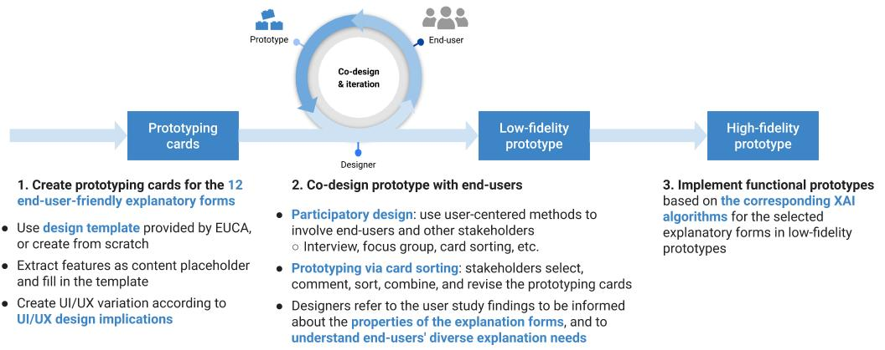

#  How to use EUCA for XAI prototyping?

##  Step 1: Create prototyping cards from explanation forms
### 1.1 Think about your input and feature data type

The input data and feature format need to be human-understandable, so that end-users can interpret the explanations which are formed by features, examples, or rules.

### 1.2 Get familiar with the [end-user-friendly explanation forms](explanation_form.md)  
There are 12 end-user-friendly explanation forms in the EUCA framework. They are grouped into four categories: explaining using features, examples, rules, and contextual information. The explanation forms are building blocks, and you can combine them to construct your end-user-oriented XAI prototype.

### 1.3 Manually extracting several interpretable features

Given the AI task and input/output data type, the designer starts by manually extracting several interpretable features. 

For example, for tabular data, the features could be the column names that describing the input, such as house size, age, and location. 

For image data, the features could be saliency image part or object for recognition, such as cars, traffic signs, or pathological appearance of a disease on chest X-ray. 

As a quick prototyping, the feature content may not necessarily reflect the true content generated by XAI algorithms, and they served as content placeholders for the prototyping card design template.

### 1.4 Fill in the prototyping card template with the extracted features

You can use the **[prototyping card design templates](README.md/#template)**, and fill in the template with the above extracted features. In this way, you create the prototyping card for each explanation form. You can regard them as individual components of your future explainable AI prototype. 

In the design template and example, we provide the basic visualization of the explanation forms used in the user study. You can also create their own template from scratch by referring to the possible **Visual Representation** part for each [explanation form](explanation_form.md). 

### 1.5 (optional) Prepare multiple cards varying UI/UX

For a particular explanation form, you may prepare multiple versions varying the visual representations (e.g.: graphics or text) and UI layout, alternating contents from brief to details, and providing different options, such as whether to use pre-defined or user-defined contrastive outcome on counterfactual example, whether to give users the option to set a threshold level for feature attribute.

You may get more inspirations from the **Design Implication** part in the [end-user-friendly explanation forms](explanation_form.md). 

Each explanation form and its variations are presented on individual prototyping cards.

### 1.6 (optional) Consider applying the general human-AI interaction guidelines in your design

While designing UI/UX variations for the prototyping cards, designers may also consider and apply the general [human-AI interaction guidelines](https://www.microsoft.com/en-us/research/uploads/prod/2019/01/Guidelines-for-Human-AI-Interaction-camera-ready.pdf), such as the following selected design guidelines that are more relevant to XAI system: 
- remember recent interactions
- support efficient invocation, dismissal and correction
- remember recent interactions
- learn from user behavior
- encourage granular feedback

##   Step 2:  Co-design and iterate low-fidelity prototype with end-users
The EUCA framework aim to facilitate your participatory design process, i.e., to involve end-users or other stakeholders in the software development lifecycle. 

### 2.1 Understanding end-users' needs for explainability
You can use the prepared explanation form prototyping cards to discuss with your users about their needs for explainability in detail. Sometimes users' motivation or trigger point to check explanations vary from calibrating trust with the AI system, to verifying the decisions from AI, to improving the predicted outcomes. The demands for explainability may be distinct for different explanatory purposes. Before your talk with the stakeholders, you may skim through the **[explanation goal analysis](need.md)** to have a general idea.

### 2.2 Talk with end-users

In the meeting with end-users, to quickly create a low-fidelity paper prototype from the prototyping cards, your end-users can select, rank, combine, modify the prototyping cards, and even sketch new ones. In this process, you may ask users why they selected or did not select a card, and their rationals for making such a card combination, whether the combination will fulfill their requirements, and what is lacking in the current prototype. 

Your users can easily manipulate the card positions to try out different layouts to examine different UI design possibilities (for example, on brewers, tablet or mobile phone).

Users can also comment on and revise each variation of the same explanation form. With the tangible prototyping card examples, designers can know in-details about users specific requirements on the UI/UX design.

The prototyping cards may facilitate the discussion of UX design, for examples, users may choose to hide some cards and only show them on-demand, or to present different explanatory information in different contexts. 

After the initial communication with users, you need to synthesize users comments and decide one or several prototype designs (such as using majority voting). Then based on the prototyping card ranking and combination, you can create low-fidelity prototypes, and continue to seek user and/or other stakeholders' feedback and iterate the prototype. 

During the above process, you may refer to the user study findings to be informed about the properties of the explanation forms (pros, cons, applicable explanation goals, and design implications in [explanation forms](explanation_form.md)).

## Step 3:  Implement a functional prototype
We list the corresponding algorithms after each explanation form, so that you or the technical partner can implement them or use the existing [open-sourced implementation](explanation_form.md/#os) to deploy your XAI prototype. You may continue to iterate your XAI system based on the implemented working prototype. 
